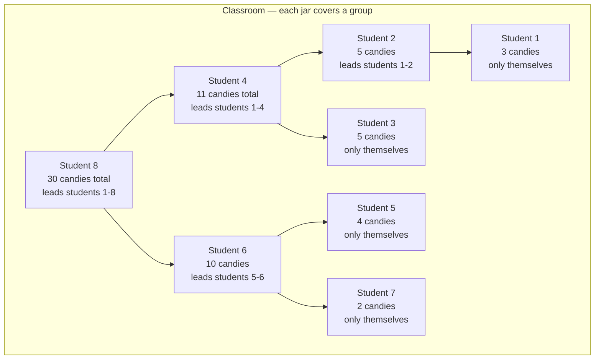

# DSA Problems

## Two Pointers

### Valid Triangle Number (Medium)

**Description**  
Count the number of triplets in an array that can form a valid triangle.

**The Rule:**  
Three sides `a`, `b`, and `c` form a triangle if:
> **a + b > c** (where `c` is the longest side)

---

### 💡 The Strategy: Sort & Shrink

By sorting the array, we only need to check one condition: **Smallest + Middle > Largest**.

#### The Step-by-Step Logic:
1.  **Sort the array:** This helps us identify the largest side (`c`) easily.
2.  **Fix the Largest Side:** We loop backwards through the array. The current number is our potential longest side `c`.
3.  **Two Pointers:** For each `c`, we place:
    *   `left` at the very beginning (the smallest side).
    *   `right` just before `c` (the middle side).
4.  **The Shortcut:**
    *   **If `nums[left] + nums[right] > c`:** 
        Since the array is sorted, if the smallest side (`left`) works, then **every side between `left` and `right`** will also work with `right` and `c`!
        *   We add them all at once: `count += (right - left)`.
        *   Move `right` down to try a different middle side.
    *   **If `nums[left] + nums[right] <= c`:**
        The sum is too small. Move `left` up to increase the sum.

**Example:** `nums = [11, 4, 9, 6, 15, 18]`
1.  Sorted: `[4, 6, 9, 11, 15, 18]`
2.  Fix `c = 18`. `left = 4`, `right = 15`.
3.  `4 + 15 = 19`. `19 > 18`? **Yes!**
4.  Everything between index 0 and 4 works. Triplets: `(4,15,18), (6,15,18), (9,15,18), (11,15,18)`.
5.  `count += 4`.

---
## Sliding Window

### Max Points You Can Obtain From Cards (Medium)

**Description**  
Given an array of integers representing card values, calculate the maximum score you can achieve by picking exactly **k** cards.

**Rules:**
*   You must pick cards in order from **either end** (left or right).
*   You can take some from the start and some from the end.
*   You **cannot** skip cards or pick from the middle.

**Example 1:**
*   `cards = [2, 11, 4, 5, 3, 9, 2]`, `k = 3`
*   **Output:** `17`
*   **Explanation:** Taking the first 3 cards (`2 + 11 + 4`) gives 17, which is the maximum possible.

**Example 2:**
*   `cards = [1, 100, 10, 0, 4, 5, 6]`, `k = 3`
*   **Output:** `111`
*   **Explanation:** Take the first 3 cards (`1 + 100 + 10 = 111`).

---

### 💡 The Simple Logic: "What's Left Behind?"

The trick to solving this easily is to look at what you **don't** pick.

If you pick **k** cards from the ends, you are leaving behind a consecutive "window" of **n - k** cards in the middle.

**Example:** `cards = [2, 11, 4, 5, 3, 9, 2]` (7 cards total), `k = 3`
*   You pick 3 cards.
*   You leave behind **4** cards (7 - 3 = 4).

Every way to pick 3 cards from the ends matches a specific window of 4 cards in the middle:
*   Pick `[2, 11, 4]` (Start) $\rightarrow$ Leave `[5, 3, 9, 2]` (Middle/End)
*   Pick `[9, 2, 2]` (End/Start) $\rightarrow$ Leave `[11, 4, 5, 3]` (Middle)

### Why This Matters
Since we know the **Total Sum** of all cards:
> **Sum of Picked Cards** = **Total Sum** - **Sum of Unpicked Cards**

To get the **Maximum** score for the cards we pick, we just need to find the **Minimum** sum of the cards we leave behind!

### The Algorithm
1.  Calculate the `total_sum` of all cards.
2.  Use a **fixed-length sliding window** of size `n - k`.
3.  Slide this window across the array to find the **min window sum**.
4.  `Max Score = total_sum - min_window_sum`.

This transforms a complex "pick from both ends" problem into a simple "find the smallest middle" problem.

---
## Heap

### Kth Largest Element in an Array (Medium)

**Description**  
Find the **k-th** largest element in an unsorted array. Note that it is the k-th largest element in the sorted order, not the k-th distinct element.

**Example:**
*   `nums = [3, 2, 1, 5, 6, 4]`, `k = 2`
*   **Output:** `5`

---

### 💡 The Strategy: Min-Heap of Size K

To find the $k$-th largest element efficiently, we don't need to sort the entire array. We only need to keep track of the **top $k$** largest numbers we've seen.

The best tool for this is a **Min-Heap**.

#### The Step-by-Step Logic:
1.  **Maintain a small "club":** We create a Min-Heap that will only hold **k** elements.
2.  **Fill the heap:** Add numbers from the array one by one.
3.  **Keep the strongest:** If the heap already has `k` elements and we find a new number that is **larger** than the smallest one in our heap (the one at the top):
    *   We remove the smallest element.
    *   We add the new, larger number.
4.  **The Result:** After looking at every number, the heap contains the $k$ largest elements of the array. Since it's a Min-Heap, the **smallest** of these $k$ elements is sitting right at the top. That smallest element is exactly the $k$-th largest!

**Why use a Min-Heap?**  
A Min-Heap makes it very fast to see the smallest element ($O(1)$) and fast to replace it ($O(\log k)$). This is much more efficient than sorting the whole array ($O(n \log n)$) when $k$ is small.

---
## Greedy

### Best Time to Buy and Sell Stock (Easy)

**Description**  
You are given an array `prices` where `prices[i]` is the price of a given stock on the $i^{th}$ day. You want to maximize your profit by choosing a **single day** to buy one stock and choosing a **different day in the future** to sell that stock.

**Example:**
*   `prices = [7, 1, 5, 3, 6, 4]`
*   **Output:** `5`
*   **Explanation:** Buy on day 2 (price = 1) and sell on day 5 (price = 6), profit = $6-1 = 5$.

---

### 💡 The Strategy: One Pass (Greedy)

The simplest way to solve this is to imagine you are walking through the timeline of prices and keeping track of the best deal you've seen so far.

#### The Step-by-Step Logic:
1.  **Look for the Floor:** As you go through the prices, keep track of the **lowest price** you have encountered so far (`min_price`).
2.  **Calculate the "What If":** For every new price you see, ask yourself: *"If I bought at my lowest price and sold today, how much money would I make?"*
3.  **Remember the Record:** Keep track of the **highest profit** you've calculated so far.
4.  **Keep Moving:** You only need to look at each price once!

**Why is this "Greedy"?**  
At every step, you are making the best possible decision based on what you've seen (updating the minimum price) and recording the best possible outcome found so far (maximum profit).

---
## Dynamic Programming

### Unique Paths (Medium)

**Description**  
You are given a robot that starts at the top-left corner of a grid with dimensions **m x n**. The robot can only move either down or right at any point in time. The goal is for the robot to reach the bottom-right corner of the grid.

Given the dimensions of the board **m** and **n**, write a function to return the number of unique paths the robot can take to reach the bottom-right corner.

**Example:**
*   `m = 3`, `n = 2`
*   **Output:** `3`
*   **Explanation:** From the top-left corner, there are a total of 3 ways to reach the bottom-right corner:
    1. Right -> Down -> Down
    2. Down -> Down -> Right
    3. Down -> Right -> Down

---

### 💡 The Strategy: Top-Down DP (Memoization)

This problem can be broken down into smaller sub-problems. To reach any cell `(i, j)`, you must have come from either the cell above it `(i-1, j)` or the cell to its left `(i, j-1)`.

#### The Step-by-Step Logic:
1.  **Base Case:** If you are in the first row (`m=1`) or the first column (`n=1`), there is only **1** way to reach any cell (by going straight right or straight down).
2.  **Recursive Relation:** The number of ways to reach `(m, n)` is the sum of the ways to reach the cell above it and the cell to its left:
    > `paths(m, n) = paths(m-1, n) + paths(m, n-1)`
3.  **Memoization:** To avoid recalculating the same paths multiple times (which would be very slow), we store for each `(m, n)` in a **dictionary (`memo`)**.
4.  **Lookup:** Before calculating a path for `(m, n)`, check if it is already in the `memo`. If it is, return it immediately!

**Why use Dynamic Programming?**  
A simple recursive solution would have an exponential time complexity of $O(2^{m+n})$. With **Memoization**, we calculate each cell's unique paths exactly once, reducing the complexity to $O(m \times n)$, which is significantly faster for larger grids.

---

### Distinct Subsequences (Hard)

**Description**  
Given two strings `s` and `t`, return the number of distinct subsequences of `s` which equals `t`.

**Example:**
*   `s = "rabbbit"`, `t = "rabbit"`
*   **Output:** `3`
*   **Explanation:** There are 3 ways to generate "rabbit" from `s` by picking different 'b's.

---

### 💡 The Strategy: Decision Tree with Memoization

To solve this, we explore all possible ways to form `t` from `s` using a recursive approach (DFS). At each step, we decide whether to include a character from `s` in our subsequence.

#### The Step-by-Step Logic:
1.  **The Goal:** We use two pointers, `i` for string `s` and `j` for string `t`.
2.  **Base Cases:**
    *   If `j` reaches the end of `t`, we found a valid subsequence! Return **1**.
    *   If `i` reaches the end of `s` but `j` hasn't finished `t`, this path failed. Return **0**.
3.  **The Decision:**
    *   **Always skip:** We can always choose to skip `s[i]` and try to find `t[j]` later in `s`.
    *   **Match & Include:** If `s[i] == t[j]`, we have an *additional* option: include `s[i]` and move both pointers forward (`i+1`, `j+1`).
4.  **Memoization:** We store the results of `(i, j)` in a `cache` dictionary to avoid repeating the same sub-problems.

**Why use this approach?**  
Without memoization, the number of paths grows exponentially. By caching the results, we ensure that each pair of indices `(i, j)` is computed only once, leading to a time complexity of $O(n \times m)$, where $n$ and $m$ are the lengths of the strings.

---
## Breadth-First Search

### Rightmost Node (Medium)

**Description**  
Given the root of a binary tree, return the rightmost node at each level of the tree. The output should be a list containing only the values of those nodes.

**Example 1:**
*   **Input:** `[1, 3, 4, null, 2, 7, null, 8]`
*   **Output:** `[1, 4, 7, 8]`

**Example 2:**
*   **Input:** `[1, 2, 5, 3, null, null, 4]`
*   **Output:** `[1, 5, 3, 4]`

---

### 💡 The Strategy: Level-Order Traversal (BFS)

To find the rightmost node at each level, we explore the tree level by level. At each level, the last node we visit is the one that would be visible from the right.

#### The Step-by-Step Logic:
1.  **Queue for Traversal:** Use a queue to keep track of nodes to visit, starting with the `root`.
2.  **Level by Level:** While the queue is not empty:
    *   Record the number of nodes at the current level (`level_size`).
    *   Iterate through these nodes one by one.
3.  **Identify the Rightmost:** For each level, the **last node** in the iteration is the rightmost node. Add its value to our result list.
4.  **Add Children:** As we visit each node, add its `left` and `right` children (if they exist) to the queue for the next level.

**Why use BFS?**  
Breadth-First Search is ideal here because it naturally groups nodes by their depth. By processing an entire level before moving to the next, we can easily identify which node is at the "end" of that level.

---

### Bus Routes (Hard)

**Description**  
You are given a 2D-integer array routes representing bus routes where routes[i] is a list of stops that the i-th bus makes. For example, if routes[0] = [3, 8, 9], it means the first bus goes through stops 3, 8, 9, 3, 8, 9, continuously.

You are also given two integers source and target, representing the starting bus stop and the destination bus stop, respectively. Write a function that takes in routes, source, and target as input, and returns the minimum number of buses you need to take to travel from source to target. Return -1 if it is not possible to reach the destination.

**Example 1:**
*   **Input:** `routes = [[3, 8, 9], [5, 6, 8], [1, 7, 10]]`, `source = 3`, `target = 6`
*   **Output:** `2`
*   **Explanation:** Take the first bus from stop 3 to stop 8, then take the second bus from stop 8 to stop 6.

**Example 2:**
*   **Input:** `routes = [[1, 2, 3], [4, 5, 6], [7, 8, 9], [10, 11, 12]]`, `source = 1`, `target = 12`
*   **Output:** `-1`

---

### 💡 The Strategy: BFS on Routes

To find the minimum number of buses, we treat each **bus route** as a node in a graph. Two buses are connected if they share a common stop.

#### The Step-by-Step Logic:
1.  **Map Stops to Buses:** Create a dictionary where each bus stop points to a list of all buses (routes) that pass through it.
2.  **BFS Queue:** Start with all buses that pass through the `source` stop. These are your "level 1" buses.
3.  **Avoid Redundancy:** Keep track of **visited buses** to ensure we don't take the same bus twice.
4.  **Expand the Search:** For each bus in the current level:
    *   Check all the stops it makes.
    *   If any stop is the `target`, you've found the minimum! Return the current bus count.
    *   If not, for each stop, find all *other* buses passing through it that you haven't taken yet, and add them to the queue for the next level.
5.  **Fail Case:** If the queue becomes empty and you haven't reached the target, return -1.

**Why use this approach?**  
By performing BFS on **buses** instead of individual stops, we significantly reduce the size of the graph. Since we want the minimum number of *buses*, each level in our BFS directly corresponds to one bus ride, ensuring we find the shortest path in terms of transfers.

---
## Binary Indexed Tree (Fenwick Tree)

### What is a BIT?

#### The analogy: a classroom of students collecting candy

Picture a classroom with 8 students standing in a line, each holding a jar. Your teacher asks two things constantly:
- "Add 3 candies to student 5's jar."
- "How many candies do students 1 through 6 have in total?"

The naive solution: ask every student one by one. For 8 students it's fine, but for 1 million students it takes forever.

**The BIT trick:** instead of every student keeping only their own candies, some students are designated *"group leaders"* who secretly also keep a running total for a group of neighbors behind them. Now to answer "total from 1 to 6", you only ask 2–3 leaders instead of 6 students.



> Students 1, 3, 5, 7 cover only themselves (odd numbers). Student 2 covers 2 students, student 4 covers 4, and student 8 covers all 8. The bigger the group, the fewer leaders you need to ask.

#### Who leads how many students?

Write each student's position in binary. The **last `1` on the right** tells you how big their group is:

```
Position 1 → binary:  000 1  ← last 1 has value 1  → leads 1 student  → covers [1..1]
Position 2 → binary:  001 0  ← last 1 has value 2  → leads 2 students → covers [1..2]
Position 3 → binary:  001 1  ← last 1 has value 1  → leads 1 student  → covers [3..3]
Position 4 → binary:  010 0  ← last 1 has value 4  → leads 4 students → covers [1..4]
Position 5 → binary:  010 1  ← last 1 has value 1  → leads 1 student  → covers [5..5]
Position 6 → binary:  011 0  ← last 1 has value 2  → leads 2 students → covers [5..6]
Position 7 → binary:  011 1  ← last 1 has value 1  → leads 1 student  → covers [7..7]
Position 8 → binary:  100 0  ← last 1 has value 8  → leads 8 students → covers [1..8]
```

In code, `i & (-i)` extracts that value automatically:

```python
i = 6        #  0110 in binary
-i = -6      #  1010 in two's complement
i & (-i) = 2 #  0010  ← picks out just the last 1, which has value 2
             #  so student 6 leads a group of 2
```

#### Querying "total from 1 to 7" — ask the right leaders

Start at student 7 and keep jumping to the previous group leader until you reach 0:

```
query(7):
  ask student 7  (covers only themselves)  → jump to 6
  ask student 6  (covers students 5–6)     → jump to 4
  ask student 4  (covers students 1–4)     → jump to 0, done!
```

3 questions instead of 7. Each jump strips the rightmost 1-bit: `i -= i & (-i)`.

#### Updating "student 3 gets +1 candy" — notify all their leaders

Start at student 3 and keep jumping to the next leader that covers them:

```
update(3, +1):
  update student 3  → jump to 4
  update student 4  → jump to 8
  update student 8  → done (out of classroom)
```

Each jump adds the rightmost 1-bit: `i += i & (-i)`.

#### Minimal implementation

```python
class BIT:
    def __init__(self, n):
        self.tree = [0] * (n + 1)      # one jar per student, 1-indexed

    def update(self, i, delta):
        while i < len(self.tree):
            self.tree[i] += delta
            i += i & (-i)              # jump to next responsible leader

    def query(self, i):                # total candies from student 1 to i
        total = 0
        while i > 0:
            total += self.tree[i]
            i -= i & (-i)             # jump to previous group leader
        return total

    def range_query(self, l, r):      # total candies from student l to r
        return self.query(r) - self.query(l - 1)
```

**When to use it?** Whenever you need fast range sums on a list that keeps changing. If the list never changes, a plain prefix sum array is simpler and equally fast.

---

### Count Number of Teams (Medium)

**Description**  
Given an array `rating` of `n` soldiers where all ratings are unique, return the number of teams of 3 soldiers `(i, j, k)` with `i < j < k` such that either:
*   `rating[i] < rating[j] < rating[k]` (ascending), or
*   `rating[i] > rating[j] > rating[k]` (descending).

**Example:**
*   **Input:** `rating = [2, 5, 3, 4, 1]`
*   **Output:** `3`
*   **Explanation:** Teams are `(2,3,4)`, `(5,4,1)`, and `(5,3,1)`.

---

### 💡 The Strategy: BIT for Left/Right Counts

Think of each soldier as a student standing in line. You want to count valid teams of 3: a short, medium, and tall student (or tall, medium, short) **in that left-to-right order**.

The key insight: **fix the middle student `j`** and count:
- How many students to their **left** are shorter → `left_smaller`
- How many students to their **right** are taller → `right_larger`

Each pair `(left_smaller × right_larger)` gives the number of valid ascending teams where `j` is the middle. Do the same for descending and sum everything up.

```
rating = [2, 5, 3, 4, 1]
                 ↑
           j = 3 (rating 3)
  left side: [2, 5] → left_smaller = 1 (only 2), left_larger = 1 (only 5)
  right side: [4, 1] → right_larger = 1 (only 4), right_smaller = 1 (only 1)

  ascending teams with j=3 as middle:  left_smaller × right_larger = 1 × 1 = 1  → team (2,3,4)
  descending teams with j=3 as middle: left_larger  × right_smaller = 1 × 1 = 1  → team (5,3,1)
```

To count efficiently, the BIT is indexed by **rating value**. As you scan left to right, each student you've already visited gets inserted into the BIT. Then `query(rating[j] - 1)` instantly tells you how many already-inserted students have a lower rating — no need to loop through everyone.

#### Step-by-step:
1. **Left pass** (left → right): before inserting `j`, query the BIT to get `left_smaller[j]` and `left_larger[j]`, then insert `rating[j]`.
2. **Right pass** (right → left): same idea with a fresh BIT to get `right_smaller[j]` and `right_larger[j]`.
3. **Answer** = sum of `left_smaller[j] × right_larger[j] + left_larger[j] × right_smaller[j]` for every `j`.

---

### Reverse Pairs (Hard)

**Description**  
Given an integer array `nums`, return the number of **reverse pairs**: pairs `(i, j)` with `i < j` and `nums[i] > 2 × nums[j]`.

**Example:**
*   **Input:** `nums = [1, 3, 2, 3, 1]`
*   **Output:** `2`
*   **Explanation:** The pairs are `(3, 1)` at indices `(1, 4)` and `(3, 1)` at indices `(3, 4)`.

---

### 💡 The Strategy: BIT with Coordinate Compression

Imagine students standing in a line, each holding a number. You want to count pairs `(i, j)` where student `i` is to the left of student `j` and **student i's number is more than double student j's number**.

The approach: scan right to left. For each student `i`, ask the BIT: *"how many students to my right have a number small enough?"* — then insert `i` into the BIT for future students to query.

```
nums = [1, 3, 2, 3, 1]

Scan right to left:
  i=4, val=1 → BIT is empty, 0 pairs. Insert 1.
  i=3, val=3 → need x where 3 > 2x → x ≤ 1. Query: how many inserted values ≤ 1? → 1 (the 1 we inserted). +1 pair. Insert 3.
  i=2, val=2 → need x ≤ 0. Query: 0 pairs. Insert 2.
  i=1, val=3 → need x ≤ 1. Query: how many inserted values ≤ 1? → 1. +1 pair. Insert 3.
  i=0, val=1 → need x ≤ 0. Query: 0 pairs.

Total = 2 ✓
```

**The problem:** values can be huge (up to ±2³¹), so you can't index the BIT directly by value — it would need billions of slots.

**The fix — coordinate compression:** before starting, sort and rank all values. Replace each value with its rank (1, 2, 3...). Now the BIT only needs `n` slots instead of billions. When querying a threshold like `x ≤ 1`, use binary search (`bisect`) to find what rank that threshold maps to.

#### Step-by-step:
1. **Compress:** sort all unique values and assign each a rank from 1 to n.
2. **Scan right to left.** For each `nums[i]`:
   - Compute threshold `= (nums[i] - 1) // 2` (the largest value that satisfies `2x < nums[i]`).
   - Use `bisect` to find the rank of that threshold, then query the BIT up to that rank.
   - Insert the rank of `nums[i]` into the BIT.
3. **Return the total count.**

---
## Segment Tree

### Range Sum Query - Mutable (Medium)

**Description**  
Given an integer array `nums`, handle multiple queries of the following types:
*   **Update** the value of an element in `nums`.
*   **Calculate the sum** of the elements of `nums` between indices `left` and `right` inclusive.

Implement the `NumArray` class with `update(index, val)` and `sumRange(left, right)`.

**Example:**
*   **Input:** `nums = [1, 3, 5]`
*   `sumRange(0, 2)` → `9` (1 + 3 + 5)
*   `update(1, 2)` → `nums = [1, 2, 5]`
*   `sumRange(0, 2)` → `8` (1 + 2 + 5)

---

### 💡 The Strategy: Segment Tree

A naive approach (plain array) gives $O(1)$ updates but $O(n)$ per range query, which is too slow when there are many queries. A **Segment Tree** is a binary tree where each node stores the **sum of a range** of the array, allowing both operations in $O(\log n)$.

#### The Step-by-Step Logic:
1.  **Build the Tree (Recursive):** Each node represents a range `[start, end]`.
    *   If `start == end`, it's a **leaf** storing `nums[start]`.
    *   Otherwise, split the range at `mid = (start + end) // 2` and recurse into left and right children.
    *   The node's value is the **sum of its two children**.
2.  **Update an Index:** Navigate from the root down to the leaf that contains `index`, update its value, and **recalculate the sums** of all ancestors on the way back up.
3.  **Query a Range `[left, right]`:** At each node, check the relationship between the node's range and the query range:
    *   **Fully outside:** return `0` (nothing to add).
    *   **Fully inside:** return the node's stored sum (already precomputed).
    *   **Partial overlap:** recurse into both children and sum the results.

**Why use a Segment Tree?**  
Because both **update** and **sumRange** operate in $O(\log n)$, handling up to $3 \times 10^4$ mixed queries efficiently. A plain array would degrade to $O(n)$ per query, and a prefix-sum approach would make `sumRange` $O(1)$ but `update` $O(n)$ — the Segment Tree balances both operations.

---

### Count of Smaller Numbers After Self (Hard)

**Description**  
Given an integer array `nums`, return an array `counts` where `counts[i]` is the number of elements **smaller than `nums[i]`** that appear **to the right** of `i`.

**Example:**
*   **Input:** `nums = [5, 2, 6, 1]`
*   **Output:** `[2, 1, 1, 0]`
*   **Explanation:**
    *   To the right of `5` are `[2, 6, 1]` → 2 smaller (`2` and `1`).
    *   To the right of `2` is `[6, 1]` → 1 smaller (`1`).
    *   To the right of `6` is `[1]` → 1 smaller.
    *   To the right of `1` is `[]` → 0.

---

### 💡 The Strategy: Segment Tree Indexed by Value

Instead of indexing the Segment Tree by **position** (like in Range Sum Query), we index it by **value**. Each leaf counts **how many times a value has appeared so far**. Then we traverse the array from **right to left** so that, by the time we process `nums[i]`, the tree already contains every element to its right.

#### The Step-by-Step Logic:
1.  **Shift the values:** Since `nums[i]` can be negative (`-10^4 ≤ nums[i] ≤ 10^4`), add an `OFFSET = 10^4` so every value lands in `[0, 20000]`. Now they can index a Segment Tree.
2.  **Build an empty Segment Tree** of size `20001` where each leaf will count occurrences of that value.
3.  **Traverse the array from right to left.** For each `nums[i]`:
    *   **Query** the range `[0, shifted_value - 1]` — this counts how many **smaller** values are already in the tree. That is `counts[i]`.
    *   **Update** position `shifted_value` by `+1` — we register that this value has been seen.
4.  **Return `counts`.**

**Why use this approach?**  
A brute-force solution is $O(n^2)$: for each `i`, scan everything to its right. With $n \leq 10^5$, that's up to $10^{10}$ operations → **TLE**. The Segment Tree reduces each query and update to $O(\log V)$ where $V$ is the value range, giving an overall complexity of $O(n \log V)$. It reuses the **exact same Segment Tree structure** as Range Sum Query — only the *interpretation* changes: leaves store **counts** instead of values, and we index by **value** instead of by **position**.

